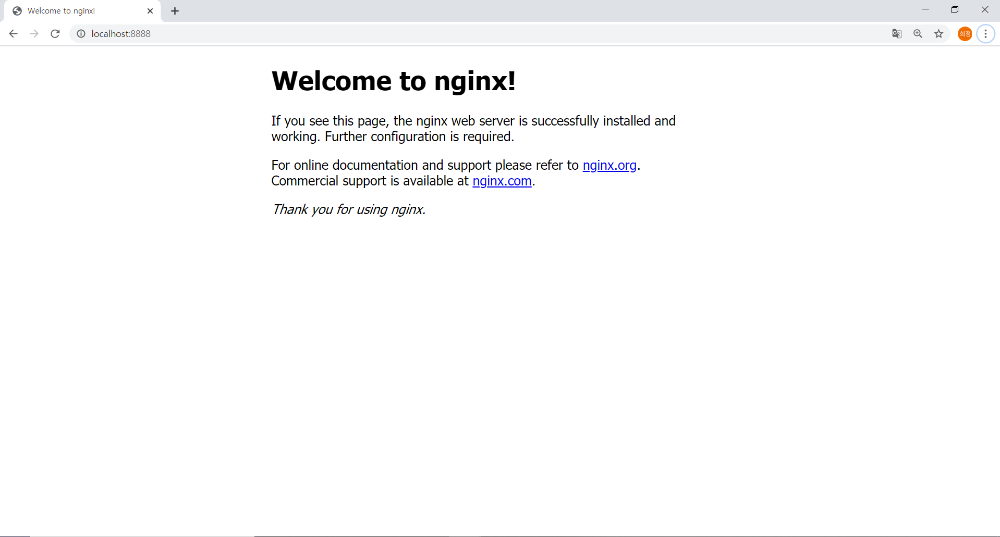

# DAY3

# DOCKERFILE
```
FROM ubuntu
RUN apt update
RUN apt install -y nginx
CMD ["nginx","-g","daemon off;"]
```

# IMAGE BUILD
```
$ docker build --tag hjkwon0501/nginx .
Sending build context to Docker daemon  601.1kB
Step 1/4 : FROM ubuntu
 ---> 74435f89ab78
Step 2/4 : RUN apt update
 ---> Using cache
 ---> eaffe9d04e59
Step 3/4 : RUN apt install -y nginx
 ---> Using cache
 ---> 1e1929b1fc37
Step 4/4 : CMD ["nginx","-g","daemon off;"]
 ---> Running in 74b5e7b72cc3
Removing intermediate container 74b5e7b72cc3
 ---> 0094129d1bbb
Successfully built 0094129d1bbb
Successfully tagged hjkwon0501/nginx:latest
SECURITY WARNING: You are building a Docker image from Windows against a non-Windows Docker host. All files and directories added to build context will have '-rwxr-xr-x' permissions. It is recommended to double check and reset permissions for sensitive files and directories.
```
# DOCKER IMAGE 확인 
```
$ docker images | grep nginx
hjkwon0501/nginx                     latest              0094129d1bbb        40 minutes ago      155MB
```
# DOCKER RUN / 결과 확인
```
$winpty docker run -it --name v2 -p 8888:80 hjkwon0501/nginx
```

