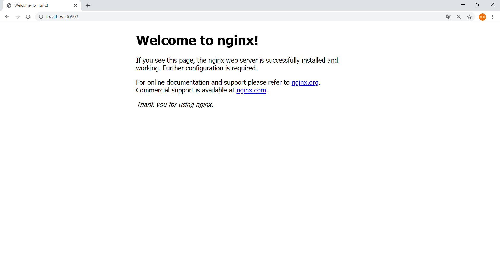

# KUBERNETES DEPLOY
```
$ kubectl run nginx2 --image=hjkwon0501/nginx --port=80
kubectl run --generator=deployment/apps.v1 is DEPRECATED and will be removed in a future version. Use kubectl run --generator=run-pod/v1 or kubectl create instead.
deployment.apps/nginx2 created

$ kubectl scale deployment nginx2 --replicas=20
deployment.extensions/nginx2 scaled
```

# CHECK 20 PODS 
```
$ kubectl.exe get po
NAME                           READY   STATUS             RESTARTS   AGE
nginx2-5f88676fb4-29ljm        1/1     Running            0          3m35s
nginx2-5f88676fb4-2rm7v        1/1     Running            0          3m35s
nginx2-5f88676fb4-2rqmk        1/1     Running            0          3m35s
nginx2-5f88676fb4-58sp2        1/1     Running            0          3m35s
nginx2-5f88676fb4-9htrp        1/1     Running            0          3m35s
nginx2-5f88676fb4-cghv6        1/1     Running            0          3m35s
nginx2-5f88676fb4-cwgml        1/1     Running            0          4m33s
nginx2-5f88676fb4-hchp8        1/1     Running            0          3m35s
nginx2-5f88676fb4-hw5zz        1/1     Running            0          3m35s
nginx2-5f88676fb4-k4jbp        1/1     Running            0          3m35s
nginx2-5f88676fb4-kptwv        1/1     Running            0          3m35s
nginx2-5f88676fb4-m6dmx        1/1     Running            0          3m35s
nginx2-5f88676fb4-mktt5        1/1     Running            0          3m35s
nginx2-5f88676fb4-ms8pq        1/1     Running            0          3m35s
nginx2-5f88676fb4-qz6n8        1/1     Running            0          3m35s
nginx2-5f88676fb4-s6xzm        1/1     Running            0          3m35s
nginx2-5f88676fb4-tzkl5        1/1     Running            0          3m35s
nginx2-5f88676fb4-vbz9m        1/1     Running            0          3m35s
nginx2-5f88676fb4-wrmmz        1/1     Running            0          3m35s
nginx2-5f88676fb4-xnh5d        1/1     Running            0          3m35s

$ kubectl get rs
NAME                     DESIRED   CURRENT   READY   AGE
nginx2-5f88676fb4        20        20        20      31m
```

# EXPOSE

```
$ kubectl expose deployment/nginx2 --type="NodePort" --port 80
Error from server (AlreadyExists): services "nginx2" already exists


$ kubectl get services
NAME         TYPE        CLUSTER-IP      EXTERNAL-IP   PORT(S)        AGE
kubernetes   ClusterIP   10.96.0.1       <none>        443/TCP        6h31m
nginx2       NodePort    10.101.31.137   <none>        80:30593/TCP   10m


user@DESKTOP-14530KF MINGW64 /c/User/user/DAY3/k8s (master)
$  kubectl describe Services/nginx2
Name:                     nginx2
Namespace:                default
Labels:                   run=nginx2
Annotations:              <none>
Selector:                 run=nginx2
Type:                     NodePort
IP:                       10.101.31.137
LoadBalancer Ingress:     localhost
Port:                     <unset>  80/TCP
TargetPort:               80/TCP
NodePort:                 <unset>  30593/TCP
Endpoints:                10.1.0.120:80,10.1.0.121:80,10.1.0.122:80 + 17 more...
Session Affinity:         None
External Traffic Policy:  Cluster
Events:                   <none>
```
  
#RESULT

